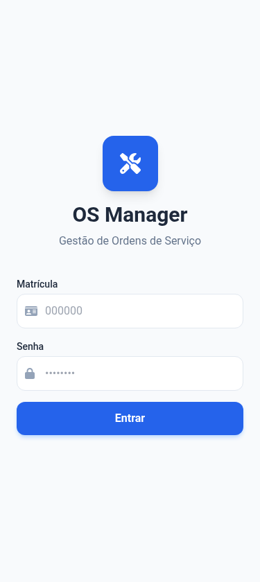
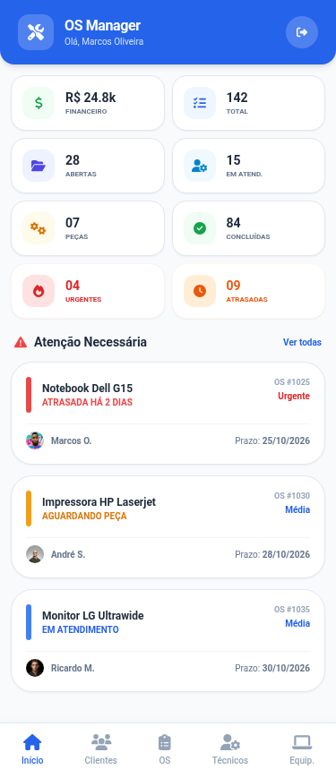
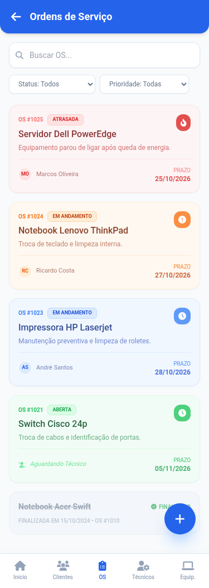
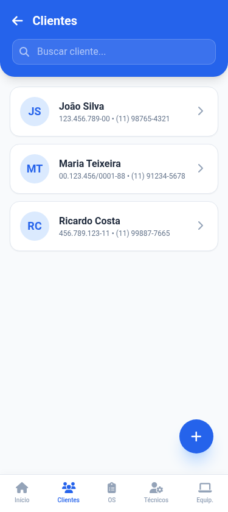
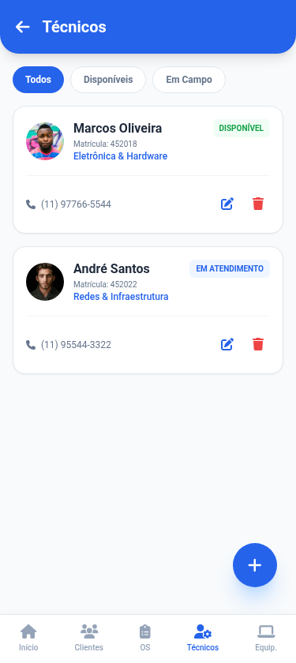
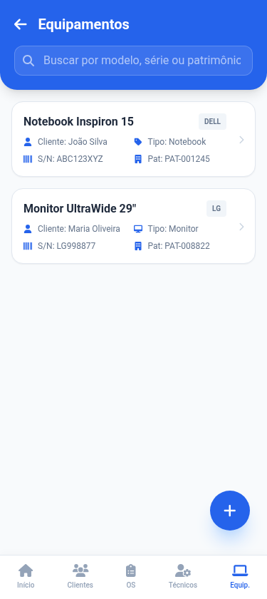
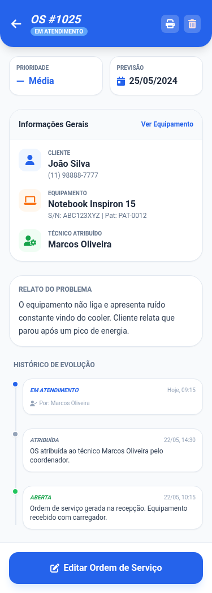
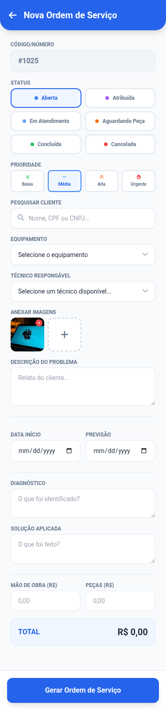
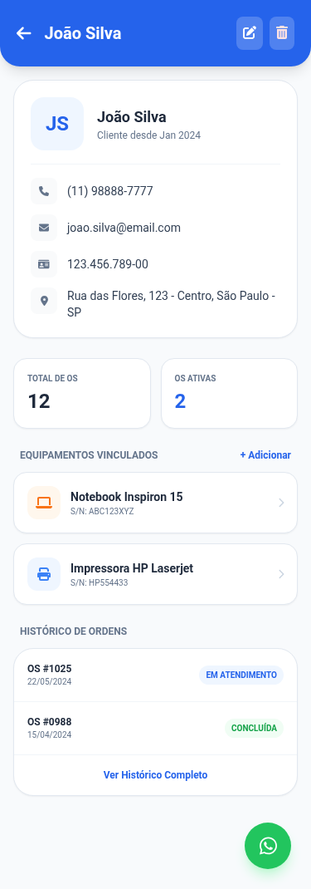

# 🔧 OS Manager

> Aplicativo Flutter para gerenciamento de ordens de serviço e manutenção técnica, com persistência local em SQLite.

---

## 📱 Visão Geral

O **OS Manager** é um aplicativo mobile/desktop voltado para empresas e técnicos que precisam organizar e acompanhar ordens de serviço. Toda a informação é armazenada localmente via SQLite, sem necessidade de conexão com internet.

---

## 🖼️ Telas

| Login | Dashboard | Ordens de Serviço |
|-------|-----------|-------------------|
|  |  |  |

| Clientes | Técnicos | Equipamentos |
|----------|----------|--------------|
|  |  |  |

| Detalhes da OS | Nova OS | Detalhe do Cliente |
|---------------|---------|-------------------|
|  |  |  |

---

## ✨ Funcionalidades

### 🔐 Autenticação
- Login com matrícula e senha
- Sessão gerenciada localmente

### 📊 Dashboard
- Indicadores de ordens abertas, concluídas, em andamento e canceladas
- Valores estimados de mão de obra e materiais
- Alertas de ordens urgentes, atrasadas e aguardando peça

### 👥 Clientes
- Cadastro, edição, visualização e exclusão
- Vinculação com ordens de serviço e equipamentos

### 🔩 Equipamentos
- Cadastro de equipamentos por cliente
- Número de série, marca, modelo e tipo
- Histórico de ordens por equipamento

### 👷 Técnicos
- Cadastro, edição, visualização e exclusão
- Vinculação com ordens de serviço

### 📋 Ordens de Serviço
- Código automático de OS
- Prioridades: **Normal**, **Alta**, **Urgente**
- Status: **Aberta**, **Em andamento**, **Aguardando Peça**, **Concluída**, **Cancelada**
- Datas de abertura e previsão de conclusão
- Diagnóstico e solução registrados
- Registro de itens/peças utilizados
- Fotos antes e depois do serviço
- Valores de mão de obra e materiais
- Geração de relatório em **PDF**
- Histórico de alterações da OS

---

## 🏗️ Arquitetura

O projeto segue uma arquitetura em camadas, separando responsabilidades de forma clara:

```
lib/
├── controllers/        # AppController — lógica de negócio e estado global
├── core/               # Tema, constantes e utilitários do app
├── models/             # Entidades: ServiceOrder, Customer, Technician, Equipment...
├── repositories/       # Acesso ao banco de dados por entidade
├── screens/            # Telas da interface (Login, Dashboard, OS, Clientes...)
├── services/           # DatabaseService (inicialização e migrations do SQLite)
├── widgets/            # Widgets reutilizáveis
└── main.dart           # Ponto de entrada do app
```

---

## 🛠️ Tecnologias e Dependências

| Pacote | Finalidade |
|--------|-----------|
| `sqflite` + `sqflite_common_ffi` | Banco de dados SQLite local |
| `sqlite3_flutter_libs` | Binários nativos do SQLite |
| `path` + `path_provider` | Localização de diretórios do sistema |
| `image_picker` | Seleção de imagens (antes/depois do serviço) |
| `pdf` + `printing` | Geração e impressão de relatórios em PDF |
| `intl` | Formatação de datas e moedas (pt-BR) |
| `mask_text_input_formatter` | Máscaras de campos de formulário |
| `currency_text_input_formatter` | Formatação de valores monetários |
| `window_manager` | Controle de janela no desktop (Windows/Linux/macOS) |

---

## 🚀 Como Executar

### Pré-requisitos

- [Flutter SDK](https://docs.flutter.dev/get-started/install) `^3.5.0`
- Dart `^3.5.0`

### Instalação

```bash
# Clone o repositório
git clone https://github.com/thiago-and/os-manager
cd os_manager

# Instale as dependências
flutter pub get

# Execute o app
flutter run
```

### Plataformas suportadas

| Plataforma | Suporte |
|------------|---------|
| Android    | ✅       |
| iOS        | ✅       |
| Windows    | ✅       |
| Linux      | ✅       |
| macOS      | ✅       |

> **Windows:** Habilite o **Modo de Desenvolvedor** nas configurações do sistema caso o Flutter solicite suporte a links simbólicos para os plugins nativos.

---

## 🗄️ Banco de Dados

O app utiliza **SQLite** com banco local armazenado no dispositivo. As tabelas principais são:

- `users` — Usuários/técnicos com acesso ao sistema
- `customers` — Clientes
- `technicians` — Técnicos
- `equipment` — Equipamentos vinculados a clientes
- `service_orders` — Ordens de serviço
- `used_items` — Itens/peças utilizados em cada OS
- `os_history` — Histórico de alterações das ordens

---

## 📁 Estrutura do Projeto

```
OS-Manager/
├── android/                 # Configurações Android
├── ios/                     # Configurações iOS
├── linux/                   # Configurações Linux
├── macos/                   # Configurações macOS
├── windows/                 # Configurações Windows
├── lib/                     # Código-fonte principal
├── design_local/            # Screenshots das telas (design reference)
├── test/                    # Testes automatizados
├── pubspec.yaml             # Dependências do projeto
└── os_manager_v3.db         # Banco de dados SQLite local (dev)
```

THIAGO SILVA RU 4917625 - UNINTER
